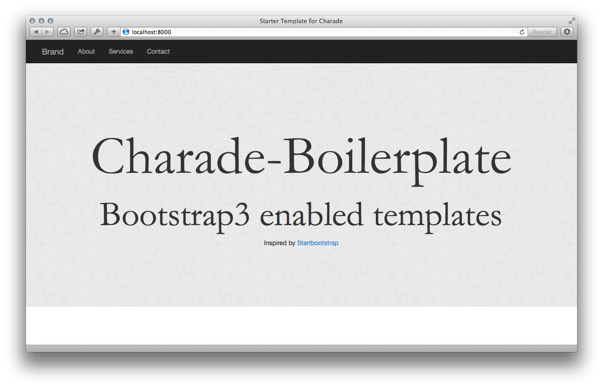

charade-boilerplate
===================

This repository contains bootstrap3 enabled templates for the haskell [charade](https://github.com/soostone/charade) rapid prototyping tool.

*this project was inspired by startbootstrap.com*

#Setup

You need the lastest ghc platform that you can download from [haskell.org](http://haskell.org/platform). After you set up your cabal path settings in your $PATH, you can run the following commands.


```sh
$ git clone https://github.com/katychuang/charade-boilerplate.git
$ cd charade-boilerplate
$ cabal sandbox init
$ cabal install charade
$ .cabal-sandbox/bin/charade

# Default port runs on 8000, for your own port use this command
$ dist/build/charade/charade -p 8080
```

Then point your browser to localhost:8000 or whichever port you specified.


## Templates

The structure of files look like the following

```sh
|-log
   |-static
   |---css
   |---fonts
   |---img
   |-----icons
   |---js
   |-----libs
   |-templates
   |---heist
```




